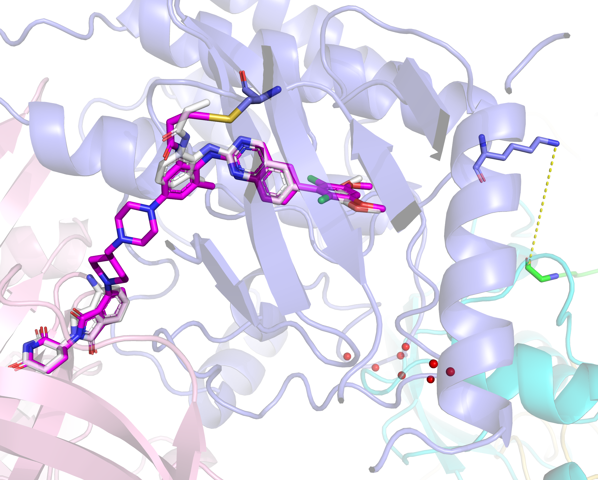

# PotentialLinker: A Ubiquitination Kinetics-Guided PROTAC Linker Reinforcement Learning Framework



## Prepare envs

We recommand CUDA GPU with 32G VRAM. RTX2080Ti 11G lead to ~1/2 complex out of memory failure, only suitable for small POI with VHL.

On VGPU 32G, a ternary spends about 2 mins. One RTX4060 8G, it will takes 10 mins or OOM fails.

REINVENT4 and boltz supports CPU devices. However, it will be too slow for boltz.

```bash
mamba create -n boltz python=3.11
mamba activate boltz

# install reinvent4
git clone https://github.com/MolecularAI/REINVENT4.git --depth 1
cd REINVENT4
python install.py cu126

# install boltz
cd ..
git clone https://github.com/alchemistcai/boltz2_for_protac.git boltz
cd boltz
pip install -e .[cuda]
export BOLTZ_CACHE = /root/autodl-tmp/boltz # change to your boltz cache dir, can be defined in .bashrc
# The first time you predict using boltz, it will download automatically. Or you can download mols and checkpoints by yourself

# install potential_linker
cd ..
git clone https://github.com/alchemistcai/PotentialLinker.git potential_linker
# or: git clone https://gitee.com/regentsai/potential-linker.git potential_linker
cd potential_linker
wget https://zenodo.org/records/15641297/files/linkinvent_transformer_pubchem.prior?download=1 -o reinvent_prior/linkinvent_transformer_pubchem.prior
pip install gemmi==0.7.5 dockq # gemmi can't parse pymol saved cif file in version 0.6.5
mamba install pymol-open-source ipykernel biopython numpy=1.26.4 scikit-learn=1.6.1 openbabel

# if you want to use our precomputed results
wget https://figshare.com/ndownloader/files/65152899 -o data_pl.zip
unzip -o data_pl.zip
```

If you want to compute results from raw database, execute the [precompute.ipynb](precompute.ipynb) notebook and generating the results(about 30h).

Using different GPU may lead to slight difference because of device precision.

If you fail to install REINVENT4 because of ISIM, alter the dependencies `REINVENT4/pyproject.toml` to my mirror repo:

```toml
isim = [
  "iSIM@git+https://gitee.com/regentsai/iSIM.git"
]
```

## Train REINVENT agents for interested targets

- Prepare a smi file including POI and E3 part ligands, split by `|`. The connect points need to be marked as `*`. 
  - CRBN-LVY / VHL-EXH E3 part is already in `boltz_fgfr4_vhl|crbn_warhead.smi.`
  - `*` markers don't need to be the first/last character.
  - You can use [Zinc15](https://zinc15.docking.org/substances/home/), ChemDraw or other softwares/webs to draw and get their smiles. Visit [CCD](https://www.ebi.ac.uk/pdbe-srv/pdbechem/) according to PDB ligand CCD code can get an unmarked SMILES too.
  - Use a unique atom like P/Br/Pt as a placeholder and alter it to `*` manually later if your software don't support wildcards.
  - Covalent ligands should remove leaving groups. Addition reaction sites should be added already without protein sidechains.
    - For example, michael receptor "C=C-C(=O)xxxx-linker" should be `C-C-C(=O)xxxx*`.
    - Chloroacetamide "ClC(=O)NH-xxxx-linker" should be `C(=O)NH-xxxx*`.
    - Again, CCD gives an reacted product SMILES if it is a covalent ligand.
- Modify `boltz_fgfr4_vhl|crbn.toml` and adjust parameters in `[[stage.scoring.component.BoltzScore.endpoint]]`.
  - Log name, checkpoint names and other related parameters should be altered too.
  - `covalent_xxx` parameters are only required for covalent PROTACs (See fgfr4 examples).
  - `params.lig_warhead_smarts` is the covalent warhead part after reaction. `[C:1]-C-C=O` is the added warhead and [C:1] is used to mark the covalent connection point.
  - Weight of NWHM scores are 1:1:1 by default (optional). Set to 1:0:0 means calculating lg_kd only.

## Sampling PROTACs and clustering

See [FGFR4.ipynb](FGFR4.ipynb) for examples.

## Benchmark

See respective scripts in the `benchmark` directory.

## Our Boltz Modification

- Enable predicting affinity for ligands with more than 56 atoms.
- Atom name method is not changed because it effects affinity scores calculation. "CL1xx","BR1xx" with more than 4 characters are treated as bad atoms right now.
- Alter `pyproject.toml` to install gemmi 0.7.5. Fix `parse/mmcif.py` so that it can read pymol adjusted cif.
- Fallback to openbabel when the 3D reference coordinate generation fails. Usually occurs for big molecules.
- You can clone Boltz official repo and alter it by yourself to keep update with it.

## Note

Residue idx of Boltz starts from 1, while alignment of biopython starts from 0. I treated them already in the framework. If one want to develop new code, be careful.

Protein sequences in PDB may have extra artificial residues (expression tags and so on). Be careful if the tags have LYS and were predicted as the PTM sites. See the sequence annotations in PDB if there is a warning.

## Acknowledge

Thanks for these cool works:

- boltz2: constrained 3D complex structure and affinity prediction
- reinvent4: customized reinforcement learning for molecule linker generation
- PROTACpedia: PDB structure and PROTAC exam information
- uniprot and PTMeXchange: Ub-PTM site info from document and proteomics source
- P4ward: CRBN/VHL-E2-Ub complex modeling, clash atom calculation

## License

Our model and code are released under MIT License.

## Cite Us

xxxx
